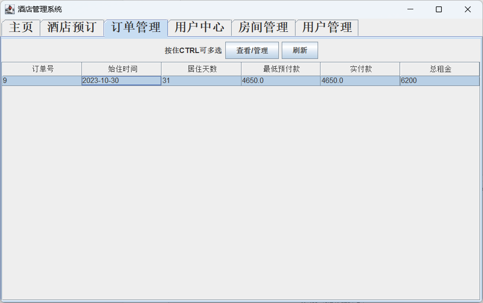
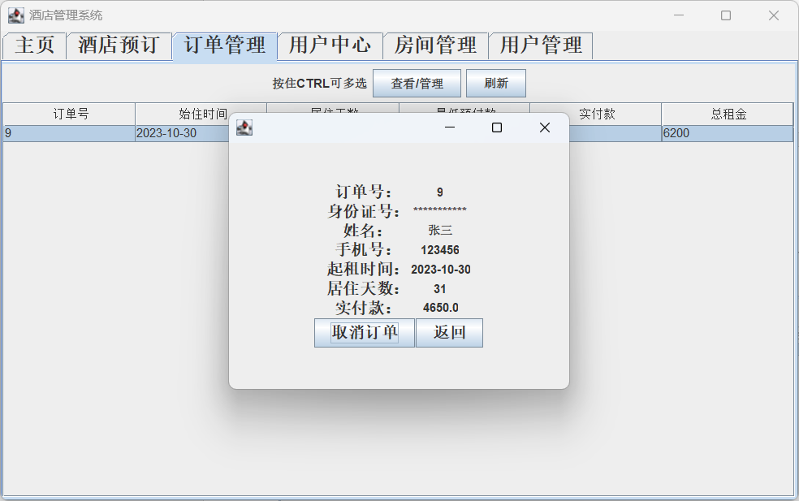

# hotel management 酒店管理系统

#### 介绍

##### 代码量：4300行


【原创】使用java swing编写的酒店管理系统

沈阳工业大学软件开发实践 课程设计

邮箱：cnzyx@sut.edu.cn

文件说明：
```    
    hotel_management.sql       ---数据库备份文件
    hotel_management.jar       ---项目打包好的jar文件，最低要求jdk1.8
```
#### 软件架构
数据库库名：hotel_management

数据库库名：root

数据库密码：root


#### 安装教程

在idea中打开即可

#### 截图







#### 参与贡献

1.  Fork 本仓库
2.  新建 Feat_xxx 分支
3.  提交代码
4.  新建 Pull Request


#### 特技

1.  使用 Readme\_XXX.md 来支持不同的语言，例如 Readme\_en.md, Readme\_zh.md
2.  Gitee 官方博客 [blog.gitee.com](https://blog.gitee.com)
3.  你可以 [https://gitee.com/explore](https://gitee.com/explore) 这个地址来了解 Gitee 上的优秀开源项目
4.  [GVP](https://gitee.com/gvp) 全称是 Gitee 最有价值开源项目，是综合评定出的优秀开源项目
5.  Gitee 官方提供的使用手册 [https://gitee.com/help](https://gitee.com/help)
6.  Gitee 封面人物是一档用来展示 Gitee 会员风采的栏目 [https://gitee.com/gitee-stars/](https://gitee.com/gitee-stars/)
